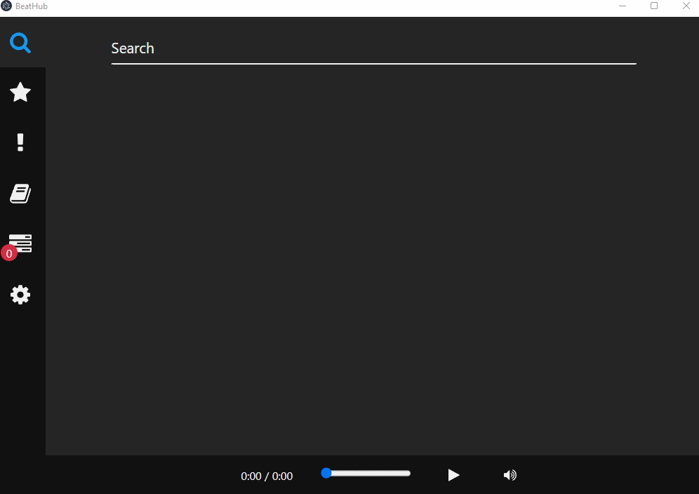
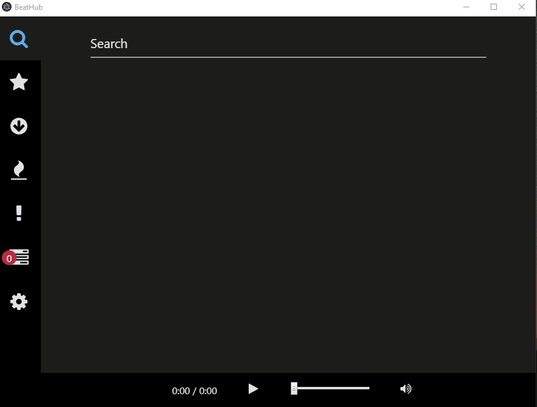
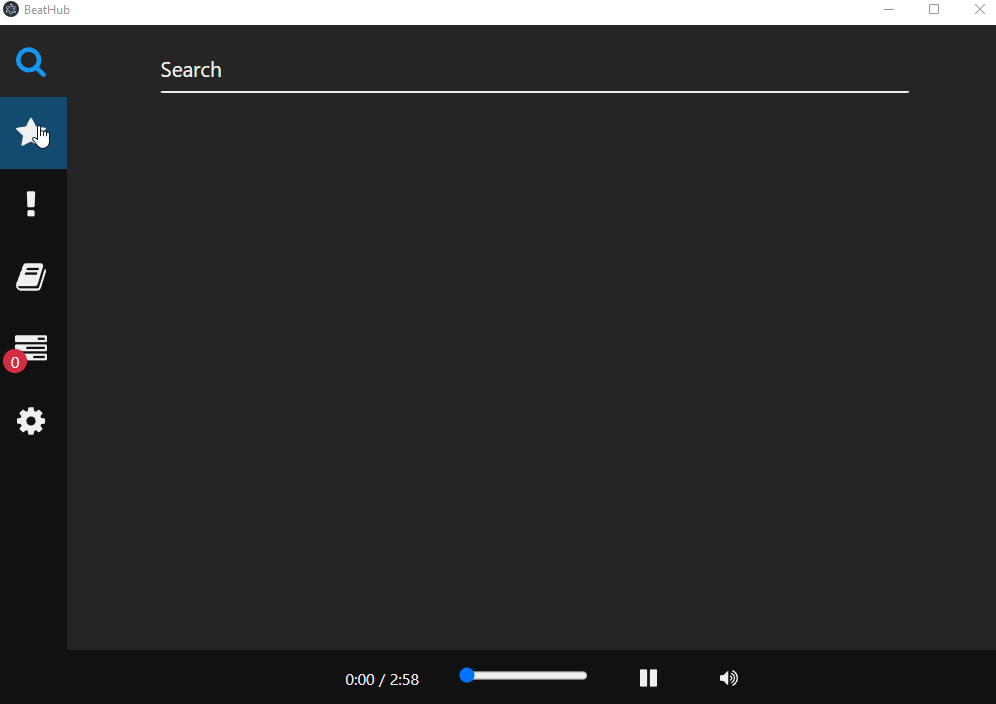
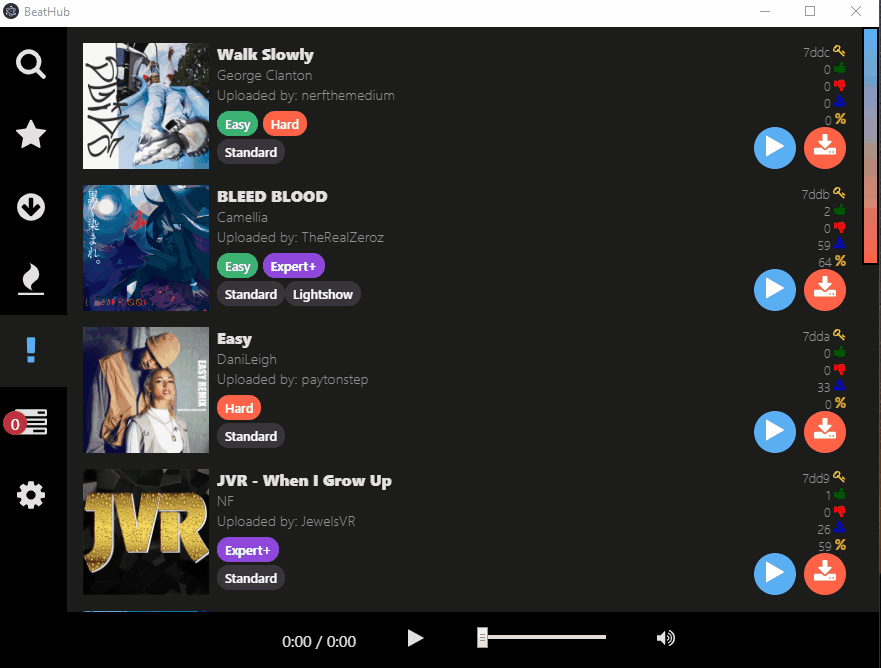
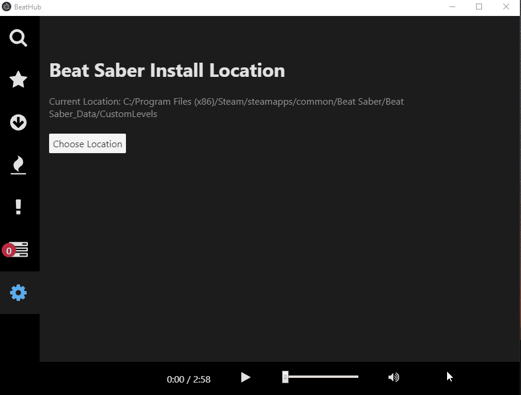

# BeatHub

## Description

A tiny and fast Beatsaver custom beatmap browser & downloader for your computer.

## Features

- Search for beatmaps available through beatsaver.com

- Browse top rated, top downloded, hottest, and newest custom beatmaps

- Preview any beatmap before downloading, scrub through the song to see how you like it.

- Quickly download custom beatmaps directly to your BeatSaber directory

- Set Beatmap download folder

## How to get

[Go to releases](https://github.com/doughtnerd/BeatHub/releases/tag/1.0.0)

## Background

I was inspired by [BeatDrop](https://github.com/StarGazer1258/BeatDrop), most of the credit goes to the developers
working on that project for ideas on how to make the client work. The rest of the credit goes to the BeatSaver.com devs for their API docs and their online site.

I started working on this because I was having a bit of an unreliable experience with the BeatDrop (not to knock that project, it's still an excellent mod & map manager) software and felt a more simplified client for browsing & downloading songs would be nice. I also at the time was playing around with [Svelte 3](https://svelte.dev/) & [Electron](https://electronjs.org/) and reeeeally wanted to
build a real world project to learn Svelte 3 with.

## Planned Features

1. Song Library Management
2. Mod installation support
3. Mac Support

## Contributing

If anyone wants to, feel free to contribute to the project.
