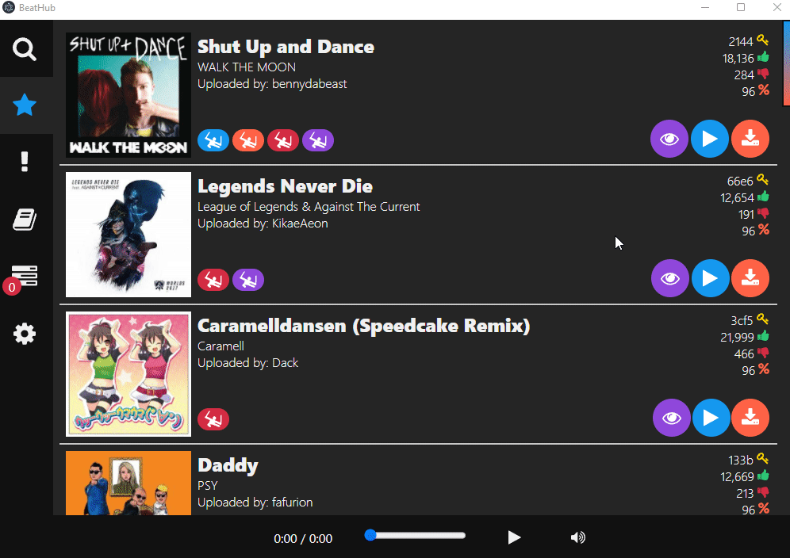

# BeatHub

## Description

A tiny and fast song browser, downloader, and library manager for Beat Saber!

---

## Feature Overview
- Discover Songs
    - [Search for songs](#search-for-songs)
    - [Browse song lists](#browse-song-lists)
- Preview Songs
    - [Visual Preview](#visual-preview)
    - [Audio Preview](#audio-preview)
- [Download Manager](#download-manager)
- [Manage your library](#library-management)
- [Change settings](#change-settings)

---

## Features

### Search for Songs
- Search for beatmaps available through beatsaver.com
- Search by artist, song name, or uploader name

### Browse Song Lists
- Browse the list of top-rated songs
- Browse the list of newest songs

### Visual Preview
- Visually preview the songs before you download it
- Scrub through the song
- Change difficulty or mode and preview it

### Audio Preview
- Listen to a song before you download it or just to have some background music :)

### Download Manager 
- Quickly download custom beatmaps directly to your Beat Saber install directory
- Check progress of your downloads
- Get an alert when your download has finished

### Library Management
- Downloaded songs will have a green check by them when you browse
- View songs in your library by artist, uploader, or song name
- Preview songs in your library
- Delete a song from your library

### Change Settings
- Change your Beat Saber install folder
- Change theme (light or dark)

---

## How to get

1. [Go to releases](https://github.com/doughtnerd/BeatHub/releases) and download the latest version.
2. If Windows tells you something like "running this isn't safe" run it anyway, it's just saying that because I haven't set up "signing" the executable (next security update hopefully)

---

## Background

I was inspired by [BeatDrop](https://github.com/StarGazer1258/BeatDrop), most of the credit goes to the developers
working on that project for ideas on how to make the client work. The rest of the credit goes to the BeatSaver.com devs for their API docs and their online site.

I started working on this because I was having a bit of an unreliable experience with the BeatDrop (not to knock that project, it's still an excellent mod & map manager) software and felt a more simplified client for browsing & downloading songs would be nice. I also at the time was playing around with [Svelte 3](https://svelte.dev/) & [Electron](https://electronjs.org/) and reeeeally wanted to
build a real world project to learn Svelte 3 with.

---

## Planned Features

1. Mod installation support
2. Signed binary, to avoid security/antivirus issues

---

## Contributing

If anyone wants to, feel free to contribute to the project.
